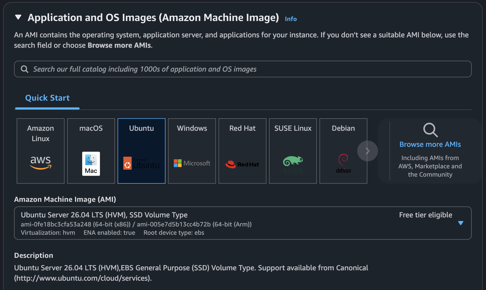
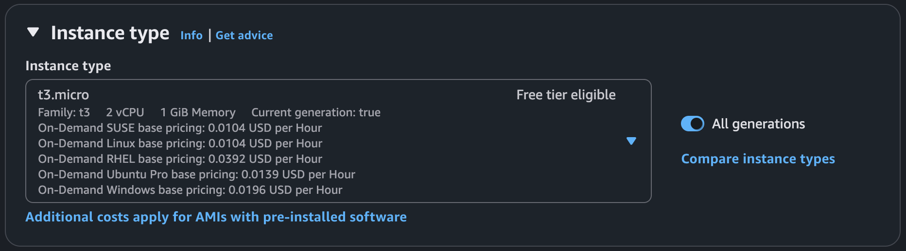
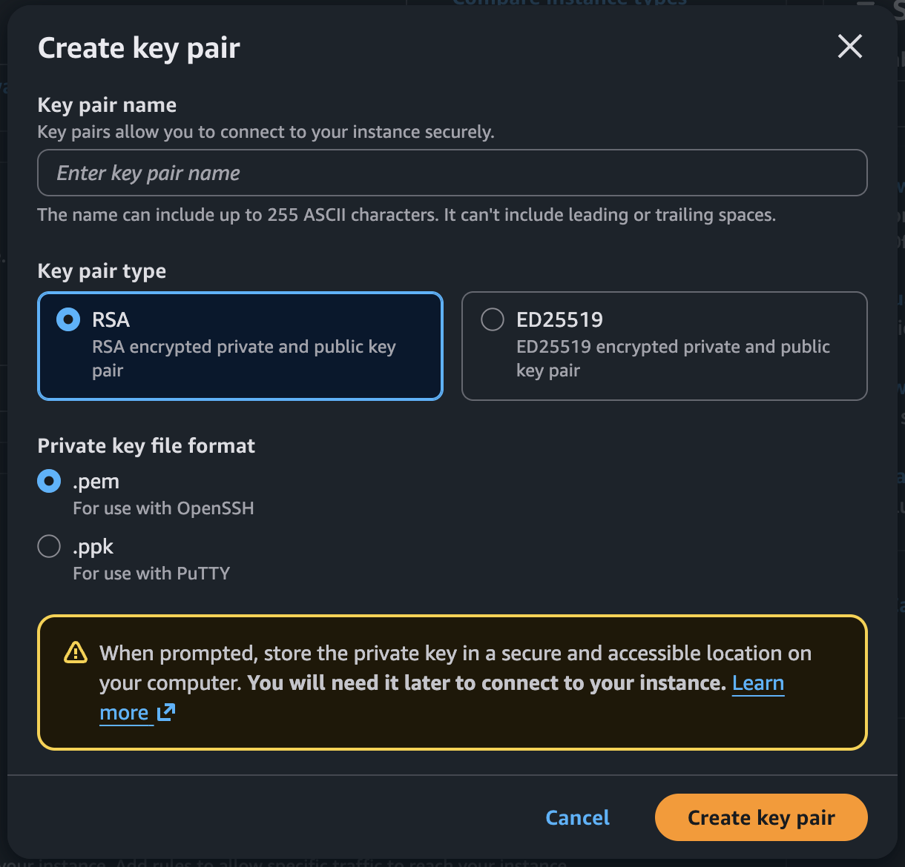
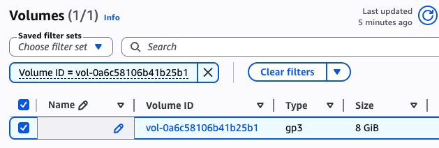
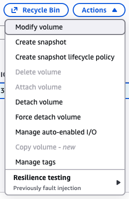
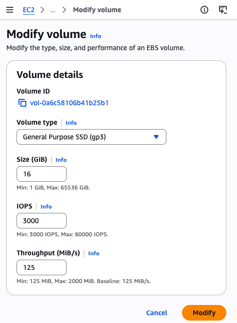

# AWS EC2 Configuration Guide: Ubuntu 26.04 LTS
> UPDATED: 06/08/2026

This guide details the specifications and steps required to provision, configure, and safely decommission a free-tier eligible Ubuntu server on AWS based on your configuration notes.

## Manual Deployment
#### 1. Amazon Machine Image (AMI) Selection
Navigate to the Quick Start AMIs catalog and select the following image. Verify the parameters carefully to ensure compatibility:

* **Name:** Ubuntu Server 26.04 LTS (HVM), SSD Volume Type
* **Description:** Canonical, Ubuntu, 26.04, amd64 resolute image. (Support available from Canonical).
* **Architecture:** x86_64
* **Virtualization:** hvm
* **Root Device Type:** ebs
* **Boot Mode:** uefi-preferred
* **ENA Enabled:** Yes
* **Verification:** Ensure the publication date matches **2026-04-21** and the AMI is tagged as **Free tier eligible**.

#### 2. Instance Type Selection
* Choose the **t3.micro** instance size.

* Confirm that the "Free tier eligible" label is explicitly visible next to the instance type. Relying on memory rather than verifying the tag can lead to unexpected compute charges.

#### 3. Download Key Pair
Download `.pem` file into `08 - Deploying on AWS/speech_recognition.pem`

#### 3. Storage Allocation (⚠️ CAUTION: Additional costs could be incurred)
The default storage configuration requires manual adjustment to meet your specifications:

* During the storage configuration step, access the **Volumes** settings.

* Select the root volume and modify the **Size** to **16 GB**.

* Ensure the volume type remains set to General Purpose (SSD).

> **NOTE:** New users receive 6 months of free tier credits, which should cover these upscaling costs.

#### 4. Network and Security Configuration
Proper network isolation is critical before launching the instance:

* Locate the sidebar menu and navigate to **Network & Security -> Security Groups**.
* Configure the inbound rules to allow necessary traffic (e.g., SSH on port 22). It is highly recommended to restrict the source IP to your specific environment rather than leaving it open to the public (`0.0.0.0/0`).

#### 5. Lifecycle Management and Cost Control
* Once testing is complete, you must completely remove the resource to avoid recurring costs.
* Select your instance and choose **Terminate (delete) instance**.
* **Note:** Simply stopping the instance only halts compute billing; you will still be charged for the 16 GB EBS volume unless the instance is fully terminated.